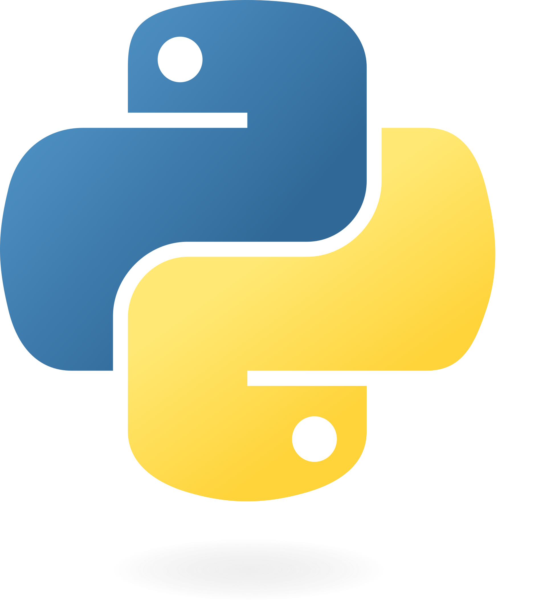

<!-- PROJECT LOGO -->
 

  

<h3 align="center">Learning Python</h3>

  

    Road to Data Engineering.
  

<!-- TABLE OF CONTENTS -->

  
Table of Contents

  <ol>
    <li>
      <a href="#about-the-project">About The Project</a>
    </li>
  </ol>

<!-- ABOUT THE PROJECT -->
## About The Project

This is project is about a starting point to Data Engineering. As first step is learn Python.

Here's why:
* I want to get into data engineering and data warehouse areas.
* Learn another language that will be useful to y career

(<a href="#readme-top">back to top</a>)
