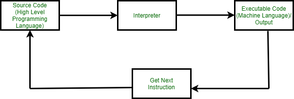

# Learning objectives
* Set up python
* Python Interpreter
* Python shell
* Output information

# Set Up
## Getting Started
This lesson will be about step-by-step process to set up this project.

## Prerequisites
You must have the following installed before working through the different lessons
* brew (Optional and just for mac)
* git
* IDE

## Install Python
* Follow below instruction to install Python using <a href="https://formulae.brew.sh/formula/python@3.12">brew formula</a> 
   ```sh
   brew install python@3.12
   ```
* Clone project
   ```sh
   git clone git@github.com:devaholic/pythonSink.git
   ```
  
# Python Interpreter
<p>
  Interpreters are the computer program that will convert the source code or high level language into intermediate 
  code (machine level language). It is also called translator in programming terminology. Interpreters executes each line 
  of statements slowly. This process is called Interpretation. For example Python is an interpreted language, PHP, Ruby, 
  and JavaScript.
</p>


# Python Shell
Most development environments include a Python shell for experimenting with code interactively. 
A shell, also called a console or terminal, is a program that allows direct interaction with an interpreter. 
The interpreter usually runs an entire program all at once. But the interpreter can run one line of code at a time 
within a Python shell.
* Start Python shell
```sh
python
```
* Run some statements/instruction
```python
2 + 2
```
* Create a variable and sign a value
```python
greeting = "Hello World"
```
* Value of a variable
```python
greeting
```
* exit
```python
quit()
```

# Basic Output
<p>
  The print() function displays output to the user. Output is the information or result produced by a program. 
The sep and end options can be used to customize the output.
</p>
| **Code**                                                                                | **Output**                                   |
|-----------------------------------------------------------------------------------------|----------------------------------------------|
| print("Today is Monday.")<br>    print("I like string beans.")                          | Today is Monday.<br>    I like string beans. |
| print("Today", "is", "Monday")<br>    print("Today", "is", "Monday", sep="...")         | Today is Monday<br>    Today...is...Monday   |
| print("Today is Monday, ", end="")<br>    print("I like string beans.")                 | Today is Monday, I like string beans.        |
| print("Today", "is", "Monday", sep="? ", end="!!")<br>    print("I like string beans.") | Today? is? Monday!!I like string beans.      |


# Exercise
Create file called helloWorld.py with:
* create a variable called greeting
* assign value Hello World
* print the value
* run the file
   ```sh
   python helloWorld.py
   ```